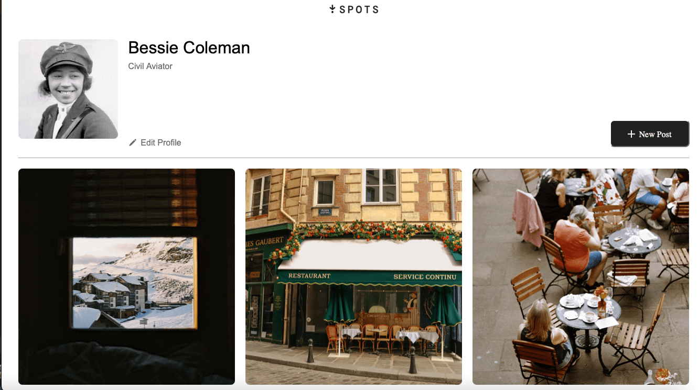

# Spots 📸

**Spots** is a modern, responsive social media platform built for photo sharing and discovery. Connect with friends, express yourself, and personalize your profile – all in a sleek, user-friendly interface that adapts beautifully to any device.



## Table of Contents

- [✨ Features](#-features)
- [🛠️ Technologies & Architecture](#️-technologies--architecture)
- [🚀 Getting Started](#-getting-started)
- [📱 Usage](#-usage)
- [🎨 Design](#-design)
- [⚙️ Development](#️-development)
- [🌐 Live Demo](#-live-demo)
- [📧 Contact](#-contact)

## ✨ Features

### Core Functionality

- 🖼️ **Interactive Photo Gallery** - Upload, view, and manage photo collections
- ❤️ **Social Interactions** - Like and unlike posts with smooth animations
- 👤 **Profile Management** - Edit your name, description, and avatar
- 🗑️ **Content Control** - Delete your own posts with confirmation
- 🔍 **Image Preview** - Full-screen image viewing with captions

### User Experience

- 📱 **Fully Responsive Design** - Optimized for mobile, tablet, and desktop
- ⌨️ **Keyboard Navigation** - ESC key support for closing modals
- ✅ **Form Validation** - Real-time input validation with error messages
- 🎯 **Click-outside Functionality** - Close modals by clicking overlay
- 🎨 **Modern UI/UX** - Clean, intuitive interface design

## 🛠️ Technologies & Architecture

### Frontend Stack

- **HTML5** - Semantic markup with accessibility features
- **CSS3** - Modern styling with Flexbox, Grid, and CSS custom properties
- **Vanilla JavaScript (ES6+)** - Modern JavaScript with modules and imports
- **BEM Methodology** - Scalable and maintainable CSS architecture

### Build Tools & Development

- **Webpack 5** - Module bundling and asset optimization
- **Babel** - JavaScript transpilation for browser compatibility
- **PostCSS & Autoprefixer** - CSS post-processing and vendor prefixes
- **CSS Modules** - Scoped styling with MiniCssExtractPlugin
- **Webpack Dev Server** - Hot reload development environment

### Code Quality & Performance

- **ES6 Modules** - Modular JavaScript architecture
- **Form Validation System** - Custom validation with reusable components
- **Event Delegation** - Efficient event handling
- **Asset Optimization** - Image and font optimization through Webpack

## 🚀 Getting Started

### Prerequisites

- **Node.js** (v14 or higher)
- **npm** (v6 or higher)

### Installation

1. **Clone the repository**:

   ```bash
   git clone https://github.com/beamendivil/se_project_spots.git
   cd se_project_spots
   ```

2. **Install dependencies**:

   ```bash
   npm install
   ```

3. **Start development server**:

   ```bash
   npm run dev
   ```

   The application will open automatically at `http://localhost:8080`

4. **Build for production**:
   ```bash
   npm run build
   ```
   Production files will be generated in the `dist/` folder

### Available Scripts

- `npm run dev` - Start development server with hot reload
- `npm run build` - Build optimized production bundle
- `npm test` - Run test suite (when implemented)

## 📱 Usage

### Getting Started

1. **View Your Profile** - See your current profile information and avatar
2. **Add New Posts** - Click the "New Post" button to upload photos with captions
3. **Interact with Content** - Like posts by clicking the heart icon
4. **Edit Profile** - Click "Edit Profile" to update your name and description
5. **Manage Content** - Delete your own posts using the delete button

### Key Interactions

- **Image Preview** - Click any image to view it in full screen
- **Form Validation** - All forms include real-time validation
- **Keyboard Support** - Press ESC to close any open modal
- **Mobile Friendly** - All features work seamlessly on mobile devices

## 🎨 Design

The UI/UX was meticulously designed using **Figma** with a focus on modern aesthetics and user experience.

**Design System Features:**

- Clean, minimalist interface
- Consistent spacing and typography
- Accessible color contrast ratios
- Intuitive iconography and visual hierarchy

🔗 **[View Figma Design](https://www.figma.com/file/BBNm2bC3lj8QQMHlnqRsga/Sprint-3-Project-%E2%80%94-Spots?type=design&node-id=2%3A60&mode=design&t=afgNFybdorZO6cQo-1)**

### Responsive Breakpoints

- **Desktop**: 1280px and above
- **Tablet**: 768px - 1279px
- **Mobile**: 320px - 767px


## ⚙️ Development

### Project Structure

```
src/
├── blocks/           # BEM CSS components
├── images/           # Static assets
├── pages/            # Main CSS entry point
├── scripts/          # JavaScript modules
│   ├── index.js     # Main application entry
│   └── validation.js # Form validation utilities
└── vendor/           # Third-party styles
```

### Architecture Highlights

- **Modular CSS**: BEM methodology with component-based organization
- **JavaScript Modules**: ES6 imports/exports for clean code separation
- **Webpack Configuration**: Optimized for both development and production
- **Form Validation**: Reusable validation system with custom error handling
- **Event Management**: Efficient event delegation and cleanup

### Development Workflow

1. **Code Organization**: Follows BEM and modular JavaScript patterns
2. **Asset Management**: Webpack handles all asset processing and optimization
3. **Hot Reload**: Instant feedback during development
4. **Build Optimization**: Production builds are minified and optimized

## 🌐 Live Demo

### Links

- **🌍 Live Site**: [https://beamendivil.github.io/se_project_spots/](https://beamendivil.github.io/se_project_spots/)
- **📹 Video Demo**: [Watch Demo] [(https://WWW.youtu.be/Luq-IDfzLXg)](https://youtu.be/Luq-IDfzLXg)
- **🎨 Figma Design**: [View Design System](https://www.figma.com/file/BBNm2bC3lj8QQMHlnqRsga/Sprint-3-Project-%E2%80%94-Spots)

### Performance Features

- ⚡ Fast loading times with optimized assets
- 📱 Smooth mobile experience
- 🔄 Efficient DOM manipulation
- 💾 Lightweight JavaScript bundle

## 📧 Contact

**Bea Mendivil** - Software Engineer  
📧 Email: bea@curatedtucson.com  
🐙 GitHub: [@beamendivil](https://github.com/beamendivil)

---

<div align="center">
  <strong>Built with ❤️ using modern web technologies</strong>
</div>
